# Anti-Copy QR Code using Moiré Patterns

## Overview

This project introduces a counterfeit prevention system for QR codes by embedding a Moiré pattern. When a QR code generated by this system is scanned with a specific optical sensor or camera, a unique Moiré pattern becomes visible. The core idea is that the subtle, high-frequency pattern embedded within the QR code is significantly altered when it is photocopied or re-scanned, due to the inherent limitations of the copying process (e.g., sampling, resolution loss). This difference allows a machine learning model to distinguish between genuine and counterfeit QR codes.

This repository contains the scripts for data preparation, model training, and evaluation for this system.

---

# Theoretical Background

## What is a Moiré Pattern?

A **moiré pattern** is a *low-frequency* interference pattern that appears when two regular, fine patterns (grids, stripes, dot screens) with slightly different spatial frequencies, orientations, or phases are overlaid. In sampled imaging systems (scanners, cameras, displays), moiré is a visible consequence of **aliasing**—high-frequency content that exceeds the sensor’s sampling capability gets misrepresented as a lower, “fake” frequency. ([imatest.com][1], [Wikipedia][2])

## Spatial Frequency & Nyquist Limit (Why aliasing happens)

* **Spatial frequency**: how rapidly intensity changes over space (e.g., lines per millimeter, cycles per pixel). Fine stripes/dots = **high spatial frequency**.
* **Sampling**: a scanner or camera measures the scene on a fixed pixel grid. Its sampling frequency $f_s$ sets a hard limit: components above **Nyquist** ($f_s/2$) cannot be recorded faithfully. Those components **fold** into lower frequencies (**aliasing**), often visible as moiré. ([imatest.com][1], [Wikipedia][2])

A classic result for two nearly parallel gratings with spatial frequencies $f_1$ and $f_2$ is a beat (moiré) frequency

$$
f_{\text{moiré}} = \lvert f_1 - f_2 \rvert,
$$

with orientation and period highly sensitive to small changes in angle/scale/phase. In sampled imaging, this “second grating” is the **sensor sampling lattice** (or another printed screen), so high-frequency content near or above Nyquist readily produces visible beats. ([ptolemy.eecs.berkeley.edu][3], [opg.optica.org][4])

## Printing & Scanning: why halftone screens matter

Most printing systems render tone with **halftone** dots at a chosen screen frequency (lpi) and angle. When a scanner’s sampling grid interacts with that halftone screen, their frequencies/angles can interfere, creating moiré in the **scanned** image—especially if the scene contains fine, periodic detail. Printers also have finite dot gain and resolution, which alter (blur/shift) high frequencies before the next sampling stage. ([Wikipedia][5], [scantips.com][6], [the-print-guide.blogspot.com][7])

Additionally, every optical/imaging chain has a **Modulation Transfer Function (MTF)** that reduces contrast as spatial frequency increases (high frequencies are transmitted with lower contrast). Near the system’s limiting resolution, tiny changes in frequency/angle move energy across the passband and can amplify or suppress visible moiré after re-sampling. ([edmundoptics.com][8], [normankoren.com][9], [Radiopaedia][10])

---

# TrueQR — Moiré-Based Anti-Counterfeit (Technical Notes)

This document explains **why a single genuine print behaves differently from a copy (scan→reprint)** when a **high-frequency micro-pattern** is embedded inside QR modules. It also uses the included plot (`sample/output.png`) to visualize how a **pixel sampling grid** acts as a **periodic pattern** and creates **visible, low-frequency moiré** from an invisible high-frequency texture.

---

## How It Works (One-paragraph summary)

* You embed a **fine, periodic micro-pattern** (stripes/dots) into the QR artwork.
* A **single high-quality print**, captured by a phone camera, yields a **stable signature** because there is only one print stage and the phone’s sampling/MTF are predictable.
* If the code is **copied** (print → **scan** → reprint), the scanner’s **pixel lattice (sampling grid)** interacts with the embedded pattern: any detail near/above the scanner’s **Nyquist limit** folds into **lower, fake frequencies (aliasing)**. Reprinting then preserves/emphasizes these low-frequency components. When the phone finally records the copy, it sees a **different moiré/texture field** than it sees on the genuine print.

---

## Visual Intuition (using `output.png`)

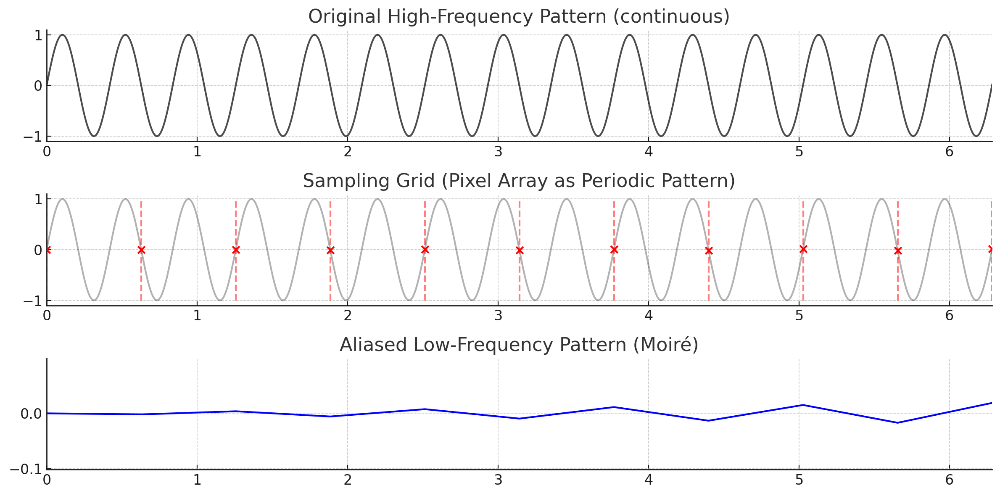

**Figure – 1D intuition for moiré via sampling**

1. **Top**: a **high-frequency continuous pattern** (think “very fine printed stripes”).
2. **Middle**: **red dots/vertical marks** represent the **sensor’s pixel grid**—an equally-spaced sampling ruler. This grid is itself a **periodic pattern** (even if invisible to the eye).
3. **Bottom**: after sampling, the recorded signal looks like a **slow, low-frequency wave**. This is **aliasing**: high-frequency content that exceeds (or grazes) the sensor’s capability is **folded** into a **lower apparent frequency**—the thing we **see as moiré**.

In 2D (images), the same principle yields **wavy bands/mesh-like patterns** whose **orientation and spacing** depend on the **difference between the pattern’s spatial frequency vector and the sampling lattice**. Small changes in angle/scale cause big visual changes.

---

## Theoretical Background

### Spatial Frequency & Nyquist

* **Spatial frequency**: how fast intensity changes **in space** (lines/mm, cycles/pixel). Fine stripes/dots = **high spatial frequency**.
* A scanner/camera samples on a **regular pixel grid** with sampling frequency $f_s$. The **Nyquist** limit is $f_N = \tfrac{f_s}{2}$. Components above Nyquist cannot be recorded faithfully—they appear as **lower “alias” frequencies**.
* Two nearly parallel gratings at $f_1$ and $f_2$ produce a **beat** (moiré) frequency

  $$
  f_{\text{moiré}}=\lvert f_1 - f_2\rvert,
  $$

  with orientation/period highly sensitive to angle/scale/phase.

### Printing, Scanning, and MTF

* Printers render tone with halftone dots and have finite resolution; paper/ink introduce **dot gain**.
* Scanners and cameras have optics + pixels; contrast decreases with frequency as described by the **Modulation Transfer Function (MTF)**. Near the resolution limit, tiny changes can move energy between pass/stop bands, making alias artifacts more visible.

---

## Genuine vs. Copied — What Actually Happens

> **“Embedded micro-pattern”** = the deliberate fine stripe/dot texture you add to QR modules.

### 1) Genuine print (single print → smartphone capture)

1. **Embedding**
   Embed a **high-frequency micro-pattern** within (but not beyond) the phone camera’s usable band so it **survives** one print and is **predictably** sampled by the phone.
2. **Print**
   A high-resolution printer places the pattern on paper. Some attenuation occurs (dot gain, MTF roll-off), but the **designed spectrum remains**.
3. **Capture**
   The phone camera samples the print once. With only one print stage and a known capture pipeline, the result is a **stable, expected signature**—a weak, controlled moiré or micro-texture your model can learn.
   *Key point:* there has been **no scan→reprint aliasing** to mangle the spectrum.

### 2) Copied artifact (print → **scan → reprint** → smartphone capture)

1. **First sampling: scanner**
   The scanner samples through its **pixel lattice**. Any components **near/above Nyquist** fold into **alias low frequencies**, shifting orientation/period unpredictably; finite apertures, lattice geometry, slight rotations, and non-ideal MTF intensify the effect.
2. **Reconstruction: reprint**
   The aliased/distorted content is then **reprinted**. Printer limits + dot gain **blur high** and relatively **boost low-frequency contrast**—often perceived as a darker/bolder region.
3. **Second sampling: smartphone**
   The phone samples a **spectrally altered** print containing alias components and contrast-shifted textures. The observed moiré/texture field now **differs consistently** from the genuine case, allowing a classifier to separate **genuine** vs **counterfeit**.

**In short:** a single print preserves your designed high-frequency cue; **scan→reprint** introduces aliasing and contrast redistribution that **convert high-frequency content into visible low-frequency moiré** (or at least a noticeably different texture) at final capture.

---

## Why Copies Often “Look Darker”

1. **Aliasing transfers energy to lower frequencies**, where the visual system and phone pipeline preserve more contrast → the area **appears bolder**.
2. **Print/scan MTF + dot gain** suppress very fine detail yet retain/coarsen low-frequency structure → **local average density/contrast rises**.

---

## Practical Design Guidelines (for the embedded micro-pattern)

* **Place the embedded band** near consumer scanners/copiers’ **vulnerable zone (near their Nyquist)** so copying tends to alias it, while single print → phone stays stable.
* **Exploit angle sensitivity**: pick orientations that are robust for genuine (print→phone) but fragile for copy paths (print→scan→reprint→phone).
* **Balance visibility**: subtle enough to pass as “solid” to the eye, strong enough to survive one print and produce a consistent capture signature.
* **Account for optics**: don’t push everything at the absolute limit—choose frequencies that remain discriminative under typical phone MTF.
* **Measure, then train**: collect spectra/textures for genuine and copied samples across multiple printers/scanners/phones; set the **operating threshold** from PR curves based on your FP/FN cost.

---

## How This Project Uses the Effect

1. **Embedding**: high-frequency micro-patterns are added to QR modules.
2. **Acquisition**: the web app crops camera frames and sends them to the server.
3. **Inference**: a CNN (MobileNetV2 backbone + attention) classifies **genuine** (single-print signature) vs **counterfeit** (alias-altered signature).
4. **Deployment**: a **single decision threshold** (picked from validation PR curves) drives the verdict shown in the UI.

---

## References (accessible overviews & primers)

* Imatest – *Nyquist frequency, aliasing, and color moiré in cameras*
  [https://www.imatest.com/docs/aliasedge/](https://www.imatest.com/docs/aliasedge/)
* Wikipedia – *Nyquist–Shannon sampling theorem*
  [https://en.wikipedia.org/wiki/Nyquist%E2%80%93Shannon\_sampling\_theorem](https://en.wikipedia.org/wiki/Nyquist%E2%80%93Shannon_sampling_theorem)
* Scantips – *Moiré patterns in scanning*
  [https://www.scantips.com/basics09.html](https://www.scantips.com/basics09.html)
* Optica/JOSA (example overview for scanned-halftone moiré, frequency/angle/aperture effects)
  [https://opg.optica.org/](https://opg.optica.org/)
* Edmund Optics – *Understanding MTF*
  [https://www.edmundoptics.com/knowledge-center/application-notes/optics/mtf/](https://www.edmundoptics.com/knowledge-center/application-notes/optics/mtf/)
* Norman Koren – *MTF, sharpness and contrast*
  [http://www.normankoren.com/Tutorials/MTF.html](http://www.normankoren.com/Tutorials/MTF.html)
* Wikipedia – *Halftone*
  [https://en.wikipedia.org/wiki/Halftone](https://en.wikipedia.org/wiki/Halftone)


---

## Methodology

### Initial Approach: Fourier Transform

The initial hypothesis was that the frequency difference between genuine and counterfeit Moiré patterns could be detected using a Fourier Transform. By analyzing the frequency spectrum of the scanned images, we aimed to find a clear threshold to distinguish between the two classes. However, this method did not yield satisfactory results, as the variations in lighting, scan angle, and noise made it difficult to establish a reliable classification baseline.

### Improved Approach: CNN-based Classification

To overcome the limitations of the Fourier Transform approach, a Convolutional Neural Network (CNN) was developed to learn the distinguishing features automatically.

#### Model Architecture

The model is a custom CNN built with TensorFlow/Keras, leveraging transfer learning from `MobileNetV2` and incorporating a `Squeeze-and-Excitation` (SE) block for attention.

The architecture is as follows:
1.  **Input Layer:** Takes a `(224, 224, 1)` grayscale image.
2.  **Initial Convolution:** A `Conv2D` layer expands the single channel to 3 channels to match the input requirements of MobileNetV2.
3.  **Base Model (MobileNetV2):** A pre-trained MobileNetV2 model (with weights from ImageNet) is used as a feature extractor. The top classification layer is excluded, and its layers are frozen (`trainable=False`).
4.  **Attention Block:** A `squeeze_excite_block` is added after the base model to allow the network to perform feature recalibration, learning to weight important features more heavily.
5.  **Pooling:** `GlobalAveragePooling2D` reduces the spatial dimensions to a feature vector.
6.  **Output Layer:** A `Dropout` layer (rate=0.3) is used for regularization, followed by a `Dense` layer with a sigmoid activation function for binary classification (True/False).

---

## Results and Analysis

### Initial Model Performance

An initial model was trained using a small input size of `64x64` pixels. This model struggled to perform reliably, with an accuracy that was not significantly better than random guessing. It became clear that downsizing the images to such a small resolution was discarding the critical, high-frequency details that differentiate genuine and counterfeit patterns.

### Improved Model Performance (224x224)

To address the poor performance, the model was retrained using a much higher input resolution of **224x224** pixels. This change proved to be critical and resulted in a dramatic improvement in performance. The model, trained on the augmented dataset, achieved **100% accuracy** on the validation set.

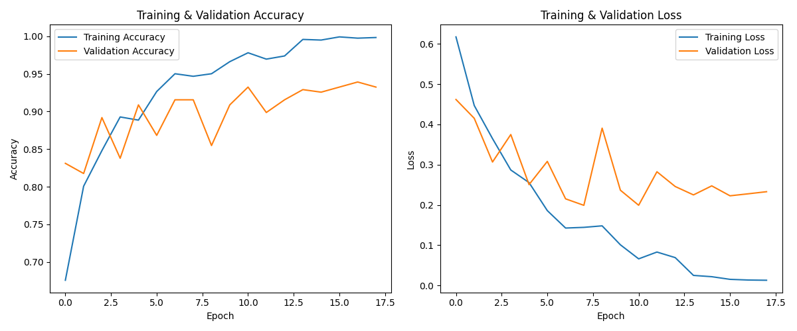
*Fig 1. Model accuracy and loss over epochs for the 224x224 model.*

The final classification report confirms the outstanding performance on the validation data:

```
--- Classification Report ---

              precision    recall  f1-score   support

  False (Counterfeit)       1.00      1.00      1.00       120
     True (Genuine)       1.00      1.00      1.00       124

         accuracy                           1.00       244
        macro avg       1.00      1.00      1.00       244
     weighted avg       1.00      1.00      1.00       244
```

### Real-World Inference Analysis

Despite the perfect score on the validation set, real-world testing using a web camera revealed several edge cases and areas for improvement. The following analysis is based on images saved in the `result/` directory.

#### Successful Cases
The model was generally successful at correctly identifying both genuine and counterfeit QR codes under good lighting conditions.

| Genuine (Correctly Identified as True) | Counterfeit (Correctly Identified as False) |
| :---: | :---: |
| 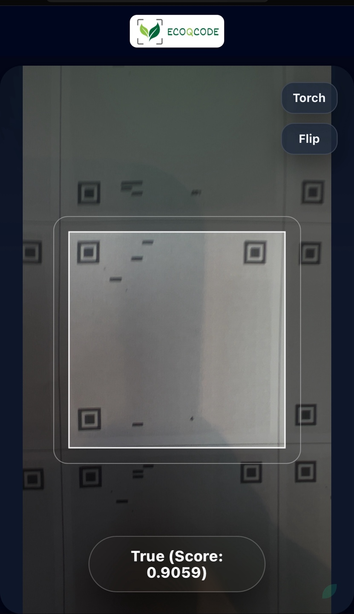 | 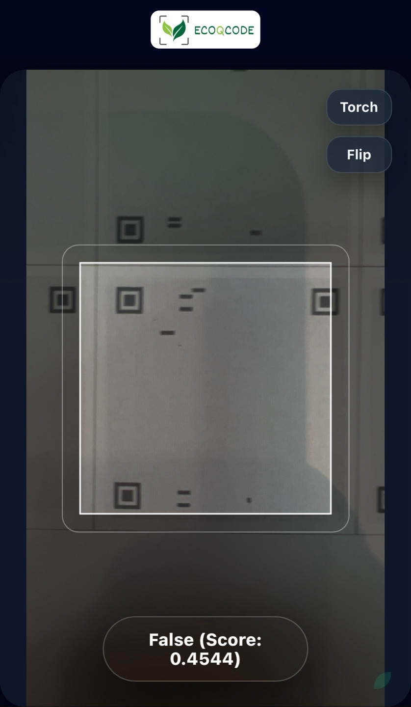 |

#### Failure Cases
However, a number of failure cases were also observed, highlighting the challenges of real-world conditions.

| Genuine (Incorrectly Identified as False) | Counterfeit (Incorrectly Identified as True) |
| :---: | :---: |
| 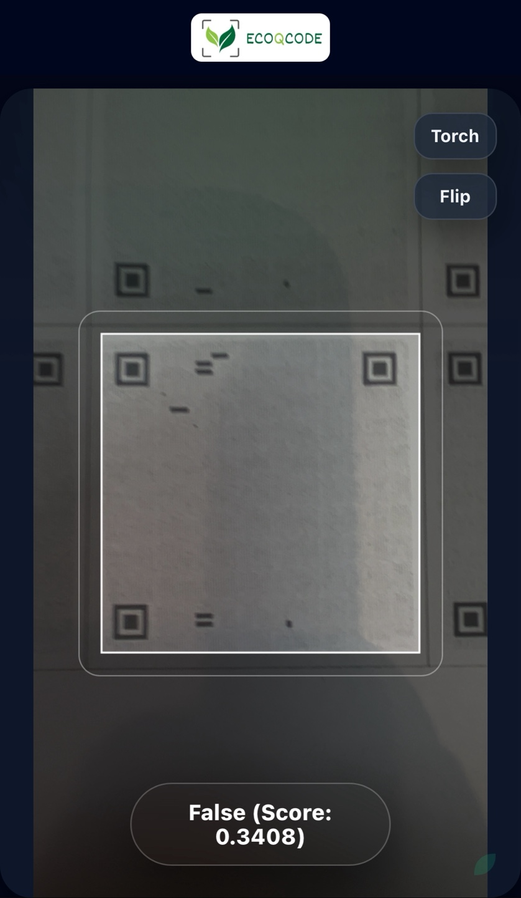 | 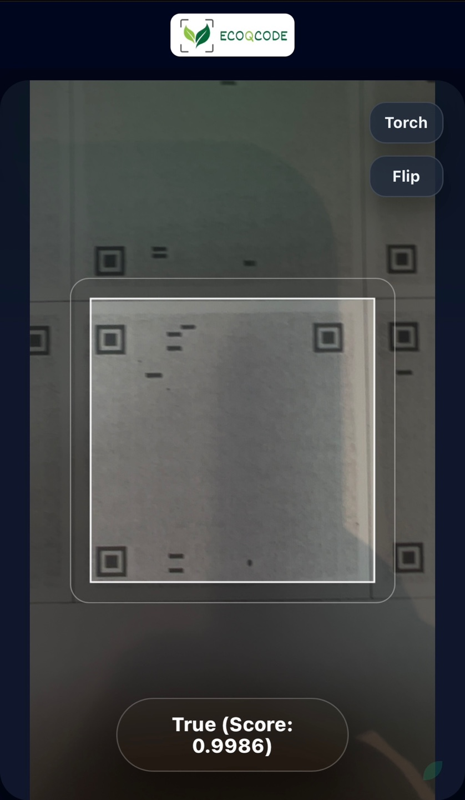 |

#### Impact of Lighting
The use of a smartphone's flashlight had a significant positive impact on performance. When the flashlight was active, the model was able to distinguish between genuine and counterfeit codes without failure.

| Genuine (Flash On) | Counterfeit (Flash On) |
| :---: | :---: |
| 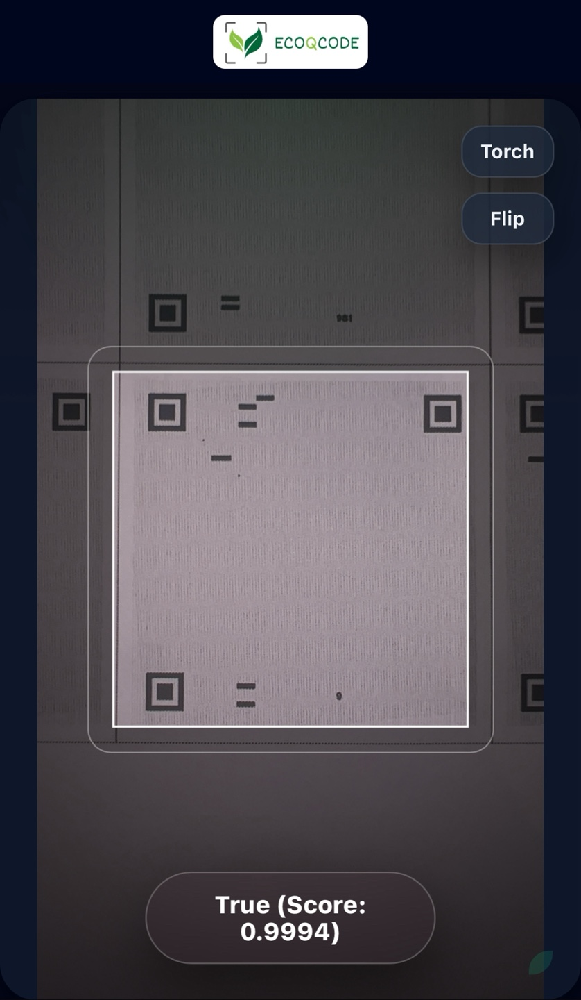 | 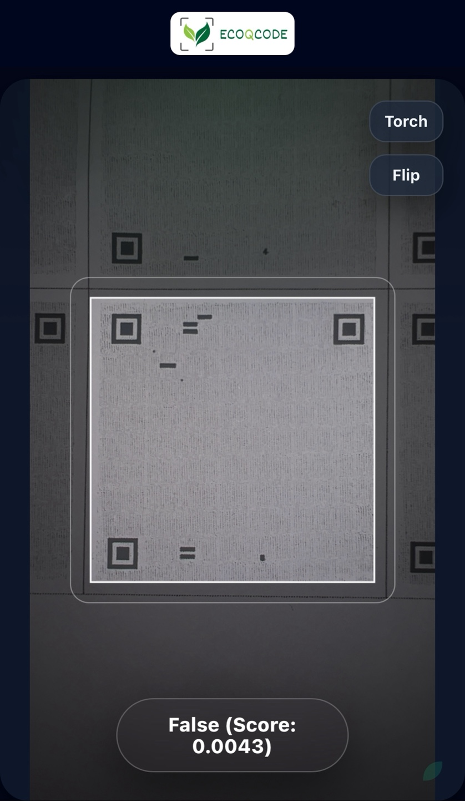 |

This suggests that consistent, bright lighting is crucial for reliable performance.

### Hypothesis for Errors

Based on this analysis, the primary reasons for the model's errors in real-world scenarios are believed to be:
1.  **Distance and Resolution:** As the distance between the camera and the QR code increases, the effective resolution of the pattern decreases. This can make the Moiré pattern too faint for the model to detect, often causing it to default to a "True" prediction.
2.  **Lack of Data Diversity:** The dataset for counterfeit examples was not sufficiently diverse. It did not include a wide variety of real-world scenarios (different lighting, angles, distances, and copy methods). This is likely a major contributor to the error rate.

---

## Iteration 2: Improving Robustness with Diverse Data

### Problem: Classifying Blank Backgrounds as "True"

A key issue identified during testing was that the model would often classify empty or non-QR code backgrounds as "True". This highlighted a significant gap in the model's training: it had learned to differentiate between genuine and counterfeit QR codes but had not been taught what constitutes "not a QR code".

### Solution: Enriching the Dataset

To address this, the dataset was improved in two ways:
1.  **Negative Sampling:** A new set of "negative" images was programmatically generated and added to the `False` category. These included blank images and images with random noise, teaching the model to associate these patterns with a "False" prediction.
2.  **Enhanced Augmentation:** The data augmentation pipeline was upgraded to include random blurring and perspective transforms, better simulating real-world variations in angle, focus, and distance.

The model was then retrained on this new, more diverse dataset. The results are stored in the `results_224_diverse_data/` directory.

### Real-World Inference Analysis (iPhone 13 Pro)

Subsequent real-world testing with an iPhone 13 Pro showed a marked improvement in the model's robustness.

#### Standard Lighting

Under standard lighting conditions, the model now correctly identifies both True and False cases with high accuracy.

| Genuine (Correctly Identified as True) | Counterfeit (Correctly Identified as False) |
| :---: | :---: |
| 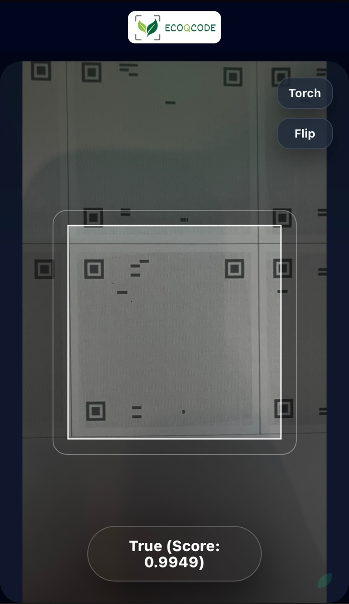 | 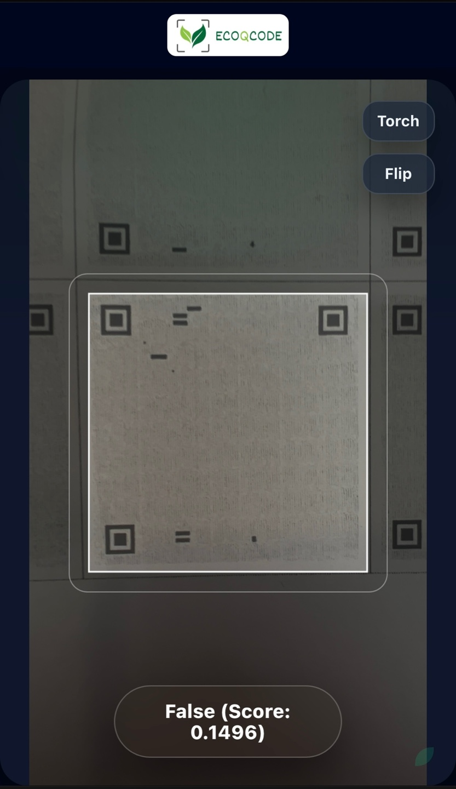 |

#### Flashlight Enabled

Testing with the flashlight revealed strong performance, though not perfect.
- **Successful Cases:** The model correctly identified both genuine and counterfeit codes in most cases.
- **Failure Case:** A few instances were observed where a counterfeit QR code was misclassified as "True".

| Genuine (Correctly Identified as True) | Counterfeit (Correctly Identified as False) | Counterfeit (Incorrectly Identified as True) |
| :---: | :---: | :---: |
| 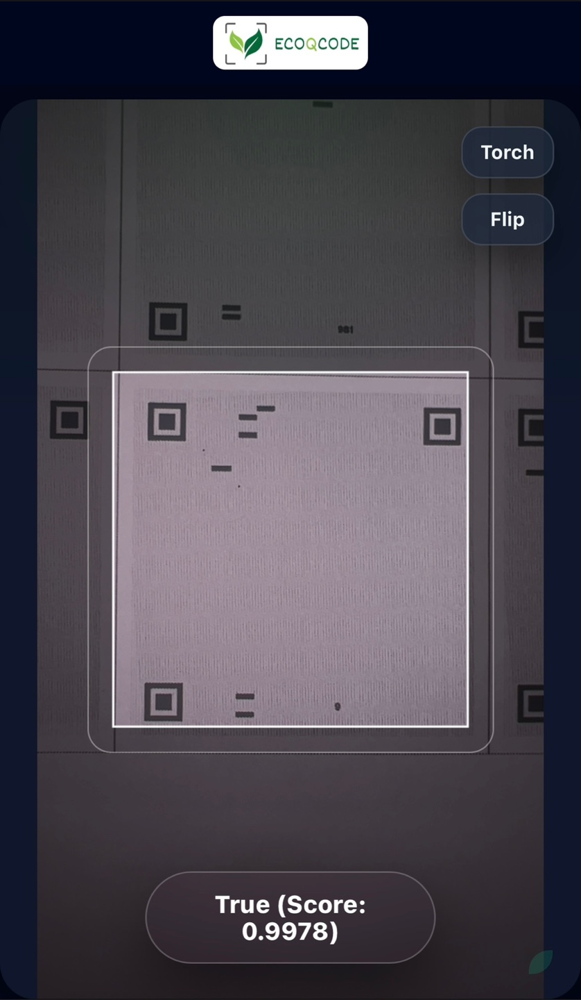 | 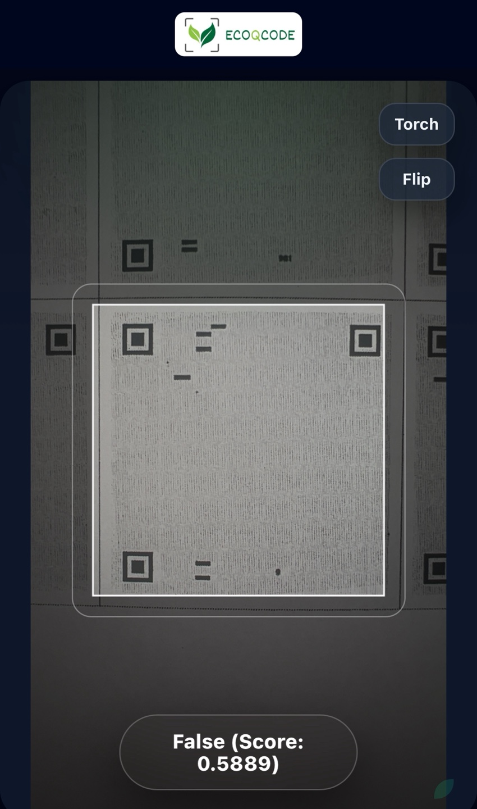 | 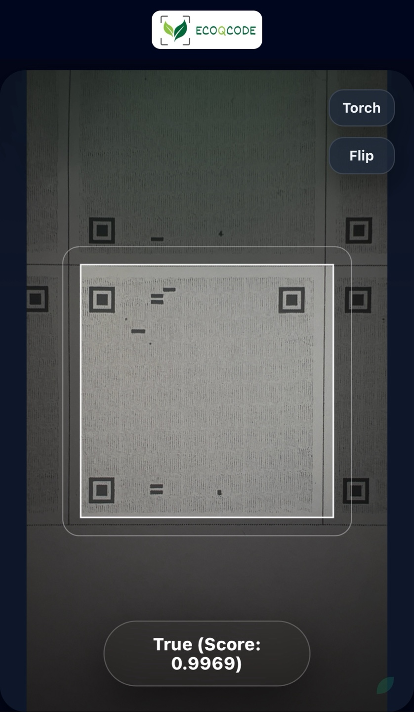 |

### Final Analysis

The addition of diverse negative samples and more robust data augmentation significantly improved the model's reliability, especially in correctly identifying non-QR patterns as "False".

While occasional errors can still occur (particularly with challenging lighting), the overall performance is much more stable. It is believed that implementing a time-based averaging system—where the application performs inference for 5-10 seconds and averages the prediction scores—would be sufficient to create a highly reliable verification system for practical use.

---

## Conclusion

This project successfully demonstrates that a CNN-based approach can effectively distinguish between genuine and counterfeit QR codes by analyzing embedded Moiré patterns. The key factor for achieving high accuracy was increasing the input image resolution from 64x64 to **224x224**, which preserved the necessary high-frequency details for the model to learn from.

While the model achieves 100% accuracy on the test dataset, real-world application reveals that its robustness can be improved. Future work should focus on:
-   **Enriching the Dataset:** Collect a much wider variety of counterfeit samples under different conditions.
-   **Variable Lighting and Distance:** Specifically train the model on images captured with varying lighting and at different distances to improve its real-world reliability.
-   **Hyperparameter Tuning:** Further optimize model parameters for even better performance on challenging, real-world data.


[1]: https://www.imatest.com/docs/nyquist-aliasing/?utm_source=chatgpt.com "Nyquist frequency, Aliasing, and Color Moire"
[2]: https://en.wikipedia.org/wiki/Nyquist%E2%80%93Shannon_sampling_theorem?utm_source=chatgpt.com "Nyquist–Shannon sampling theorem"
[3]: https://ptolemy.eecs.berkeley.edu/eecs20/week13/moire.html?utm_source=chatgpt.com "Aliasing in Images"
[4]: https://opg.optica.org/abstract.cfm?uri=josa-72-9-1190&utm_source=chatgpt.com "Moiré patterns in scanned halftone pictures"
[5]: https://en.wikipedia.org/wiki/Halftone?utm_source=chatgpt.com "Halftone"
[6]: https://www.scantips.com/basics06.html?utm_source=chatgpt.com "Moire patterns"
[7]: https://the-print-guide.blogspot.com/2009/05/halftone-screen-angles.html?utm_source=chatgpt.com "Halftone screen angles"
[8]: https://www.edmundoptics.com/knowledge-center/application-notes/optics/introduction-to-modulation-transfer-function/?srsltid=AfmBOopTD7Hh_V2WxArZ-G1_96bCnRRRo1r66YxsOSI8SDdLwXKWu5fM&utm_source=chatgpt.com "Introduction to Modulation Transfer Function"
[9]: https://www.normankoren.com/Tutorials/MTF.html?utm_source=chatgpt.com "Understanding resolution and MTF"
[10]: https://radiopaedia.org/articles/modulation-transfer-function?lang=us&utm_source=chatgpt.com "Modulation transfer function | Radiology Reference Article"
[11]: https://www.lars.purdue.edu/home/references/LTR_111772.pdf?utm_source=chatgpt.com "Moire Patterns And Two-Dimensional Aliasing In Line ..."
[12]: https://www.sciencedirect.com/science/article/abs/pii/S0262885699000839?utm_source=chatgpt.com "Analysis of moire patterns in non-uniformly sampled ..."
