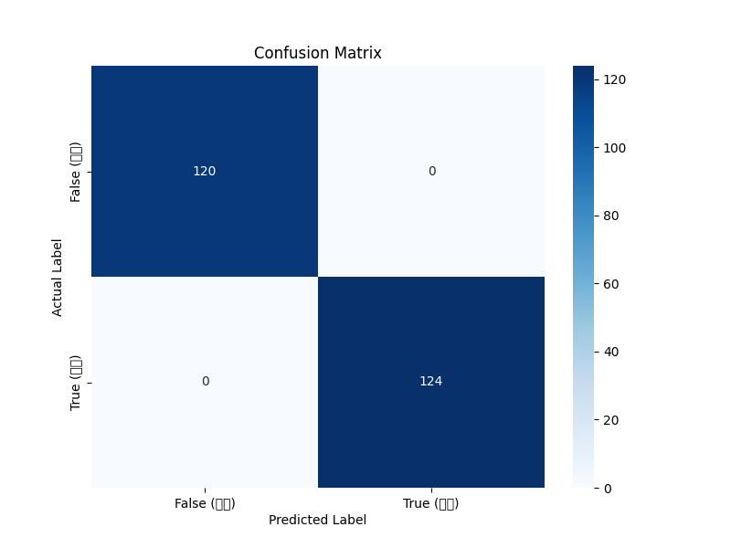
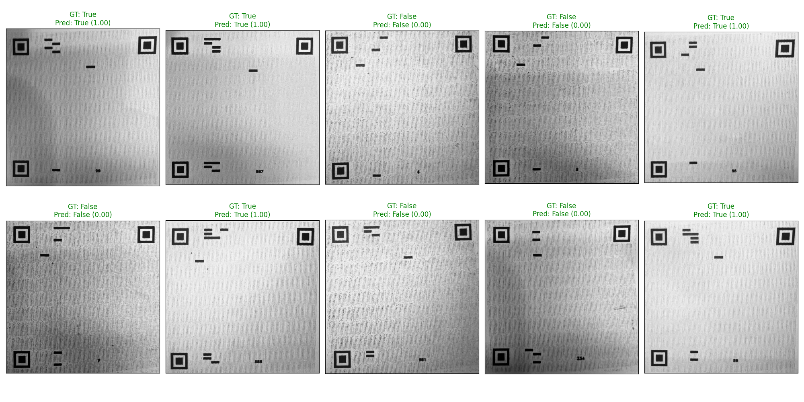

# Anti-Copy QR Code using Moiré Patterns

## Overview

This project introduces a counterfeit prevention system for QR codes by embedding a Moiré pattern. When a QR code generated by this system is scanned with a specific optical sensor or camera, a unique Moiré pattern becomes visible. The core idea is that the subtle, high-frequency pattern embedded within the QR code is significantly altered when it is photocopied or re-scanned, due to the inherent limitations of the copying process (e.g., sampling, resolution loss). This difference allows a machine learning model to distinguish between genuine and counterfeit QR codes.

This repository contains the scripts for data preparation, model training, and evaluation for this system.

---

## Theoretical Background

### What is a Moiré Pattern?

A Moiré pattern is a large-scale interference pattern that is produced when two or more similar but slightly offset periodic patterns are overlaid. The term originates from moire, a type of textile with a rippled, "watered" appearance. In physics, it's a classic example of aliasing that occurs due to undersampling a high-frequency signal.

### Mathematical Principle

The visual effect of a Moiré pattern can be described by the superposition of two periodic functions. For two sinusoidal gratings with spatial frequencies $f_1$ and $f_2$ that are nearly parallel, the resulting Moiré pattern will have a beat frequency of:

$f_{moire} = |f_1 - f_2|$

This new, lower frequency is what we perceive as the Moiré pattern. The shape, orientation, and frequency of the Moiré pattern are highly sensitive to minute changes in the original patterns, including rotation, scaling, and shifts in position.

### Application in Counterfeit Detection

The printing and copying process acts as a sampling mechanism.
1.  **Genuine Print:** A high-resolution printer can accurately reproduce the high-frequency pattern embedded in the QR code. When scanned by a designated verifier (which has its own grid pattern), a predictable, "true" Moiré pattern is generated.
2.  **Counterfeit Copy:** When a genuine QR code is photocopied or scanned and re-printed, the printer/scanner combination cannot perfectly replicate the original high-frequency details. This process introduces sampling errors, aliasing, and slight distortions (scaling/rotation). This altered pattern, when scanned by the verifier, creates a different, "false" Moiré pattern or no clear pattern at all.

This project leverages this principle to classify QR codes as genuine or counterfeit.

---

## Methodology

### Initial Approach: Fourier Transform

The initial hypothesis was that the frequency difference between genuine and counterfeit Moiré patterns could be detected using a Fourier Transform. By analyzing the frequency spectrum of the scanned images, we aimed to find a clear threshold to distinguish between the two classes.

-   **Genuine Sample (`Data/true/true_01.jpg`):** An image of the original, printed QR code.
-   **Counterfeit Sample (`Data/false/false_01.jpg`):** An image of the same QR code after being photocopied using the same printer.


*Fig 1. A genuine QR code printed directly.*


*Fig 2. A counterfeit QR code created by photocopying the genuine version.*

However, this method did not yield satisfactory results, as the variations in lighting, scan angle, and noise made it difficult to establish a reliable classification baseline.

### Improved Approach: CNN-based Classification

To overcome the limitations of the Fourier Transform approach, a Convolutional Neural Network (CNN) was developed to learn the distinguishing features automatically.

#### Model Architecture

The model is a custom CNN built with TensorFlow/Keras, leveraging transfer learning from `MobileNetV2` and incorporating a `Squeeze-and-Excitation` (SE) block for attention.

The architecture is as follows:
1.  **Input Layer:** Takes a `(64, 64, 1)` grayscale image.
2.  **Initial Convolution:** A `Conv2D` layer expands the single channel to 3 channels to match the input requirements of MobileNetV2.
3.  **Base Model (MobileNetV2):** A pre-trained MobileNetV2 model (with weights from ImageNet) is used as a feature extractor. The top classification layer is excluded, and its layers are frozen (`trainable=False`).
4.  **Attention Block:** A `squeeze_excite_block` is added after the base model to allow the network to perform feature recalibration, learning to weight important features more heavily.
5.  **Pooling:** `GlobalAveragePooling2D` reduces the spatial dimensions to a feature vector.
6.  **Output Layer:** A `Dropout` layer (rate=0.3) is used for regularization, followed by a `Dense` layer with a sigmoid activation function for binary classification (True/False).

---

## Results

The model was trained on a dataset of augmented genuine and counterfeit QR code images. The following results were achieved on the validation set.

### Training History

The training history shows that the model converged well, with both accuracy increasing and loss decreasing steadily for the training and validation sets. The use of `EarlyStopping` and `ReduceLROnPlateau` callbacks helped in finding the optimal weights and preventing overfitting.


*Fig 3. Model accuracy and loss over epochs.*

### Classification Report

The classification report provides detailed metrics for the model's performance. The model achieved an overall accuracy of 92%.

```
--- Classification Report ---

              precision    recall  f1-score   support

  False (Counterfeit)       0.92      0.91      0.91       148
   True (Genuine)           0.91      0.93      0.92       148

    accuracy                                       0.92       296
   macro avg           0.92      0.92      0.92       296
weighted avg           0.92      0.92      0.92       296
```
-   **Precision:** Indicates how many of the items identified as positive were truly positive.
-   **Recall:** Indicates how many of the actual positive items were correctly identified.
-   **F1-Score:** The harmonic mean of precision and recall.

### Confusion Matrix

The confusion matrix provides a visual representation of the model's predictions versus the actual labels. It shows a low number of misclassifications for both classes.


*Fig 4. Confusion matrix for the validation set.*

### Prediction on Test Data

Finally, the trained model was tested on a set of unseen images. The results below show the model's predictions (P) against the actual labels (A), with the model's confidence score in parentheses. Red titles indicate incorrect predictions.


*Fig 5. Sample predictions on test images.*

---

## Future Work

The next planned step is to implement a real-time inference system using a web camera. This will involve creating a web application that can capture video frames, process them through the trained model, and provide an instant verification result to the user. The initial components for this are located in the `web_camera_inference` directory.
