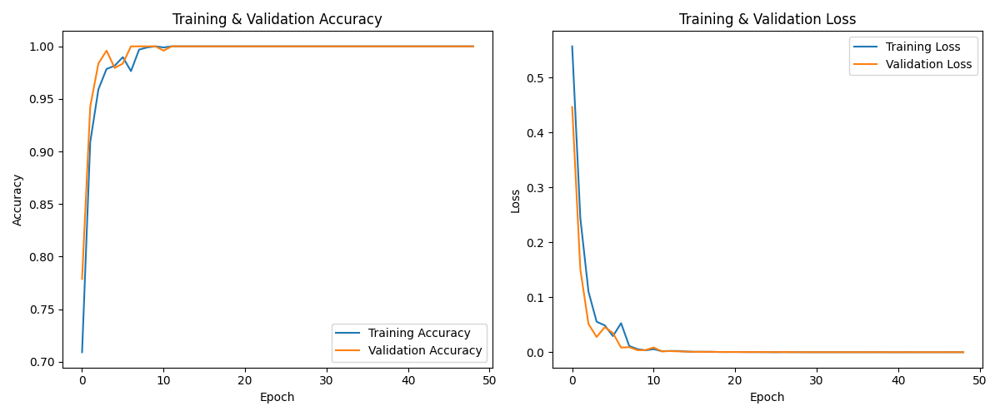

# Anti-Copy QR Code using Moiré Patterns

## Overview

This project introduces a counterfeit prevention system for QR codes by embedding a Moiré pattern. When a QR code generated by this system is scanned with a specific optical sensor or camera, a unique Moiré pattern becomes visible. The core idea is that the subtle, high-frequency pattern embedded within the QR code is significantly altered when it is photocopied or re-scanned, due to the inherent limitations of the copying process (e.g., sampling, resolution loss). This difference allows a machine learning model to distinguish between genuine and counterfeit QR codes.

This repository contains the scripts for data preparation, model training, and evaluation for this system.

---

## Theoretical Background

### What is a Moiré Pattern?

A Moiré pattern is a large-scale interference pattern that is produced when two or more similar but slightly offset periodic patterns are overlaid. The term originates from moire, a type of textile with a rippled, "watered" appearance. In physics, it's a classic example of aliasing that occurs due to undersampling a high-frequency signal.

### Mathematical Principle

The visual effect of a Moiré pattern can be described by the superposition of two periodic functions. For two sinusoidal gratings with spatial frequencies \$f_1\$ and \$f_2\$ that are nearly parallel, the resulting Moiré pattern will have a beat frequency of:

\$f_{moire} = |f_1 - f_2|\$

This new, lower frequency is what we perceive as the Moiré pattern. The shape, orientation, and frequency of the Moiré pattern are highly sensitive to minute changes in the original patterns, including rotation, scaling, and shifts in position.

### Application in Counterfeit Detection

The printing and copying process acts as a sampling mechanism.
1.  **Genuine Print:** A high-resolution printer can accurately reproduce the high-frequency pattern embedded in the QR code. When scanned by a designated verifier (which has its own grid pattern), a predictable, "true" Moiré pattern is generated.
2.  **Counterfeit Copy:** When a genuine QR code is photocopied or scanned and re-printed, the printer/scanner combination cannot perfectly replicate the original high-frequency details. This process introduces sampling errors, aliasing, and slight distortions (scaling/rotation). This altered pattern, when scanned by the verifier, creates a different, "false" Moiré pattern or no clear pattern at all.

This project leverages this principle to classify QR codes as genuine or counterfeit.

---

## Methodology

### Initial Approach: Fourier Transform

The initial hypothesis was that the frequency difference between genuine and counterfeit Moiré patterns could be detected using a Fourier Transform. By analyzing the frequency spectrum of the scanned images, we aimed to find a clear threshold to distinguish between the two classes. However, this method did not yield satisfactory results, as the variations in lighting, scan angle, and noise made it difficult to establish a reliable classification baseline.

### Improved Approach: CNN-based Classification

To overcome the limitations of the Fourier Transform approach, a Convolutional Neural Network (CNN) was developed to learn the distinguishing features automatically.

#### Model Architecture

The model is a custom CNN built with TensorFlow/Keras, leveraging transfer learning from `MobileNetV2` and incorporating a `Squeeze-and-Excitation` (SE) block for attention.

The architecture is as follows:
1.  **Input Layer:** Takes a `(224, 224, 1)` grayscale image.
2.  **Initial Convolution:** A `Conv2D` layer expands the single channel to 3 channels to match the input requirements of MobileNetV2.
3.  **Base Model (MobileNetV2):** A pre-trained MobileNetV2 model (with weights from ImageNet) is used as a feature extractor. The top classification layer is excluded, and its layers are frozen (`trainable=False`).
4.  **Attention Block:** A `squeeze_excite_block` is added after the base model to allow the network to perform feature recalibration, learning to weight important features more heavily.
5.  **Pooling:** `GlobalAveragePooling2D` reduces the spatial dimensions to a feature vector.
6.  **Output Layer:** A `Dropout` layer (rate=0.3) is used for regularization, followed by a `Dense` layer with a sigmoid activation function for binary classification (True/False).

---

## Results and Analysis

### Initial Model Performance

An initial model was trained using a small input size of `64x64` pixels. This model struggled to perform reliably, with an accuracy that was not significantly better than random guessing. It became clear that downsizing the images to such a small resolution was discarding the critical, high-frequency details that differentiate genuine and counterfeit patterns.

### Improved Model Performance (224x224)

To address the poor performance, the model was retrained using a much higher input resolution of **224x224** pixels. This change proved to be critical and resulted in a dramatic improvement in performance. The model, trained on the augmented dataset, achieved **100% accuracy** on the validation set.


*Fig 1. Model accuracy and loss over epochs for the 224x224 model.*

The final classification report confirms the outstanding performance on the validation data:

```
--- Classification Report ---

              precision    recall  f1-score   support

  False (Counterfeit)       1.00      1.00      1.00       120
     True (Genuine)       1.00      1.00      1.00       124

         accuracy                           1.00       244
        macro avg       1.00      1.00      1.00       244
     weighted avg       1.00      1.00      1.00       244
```

### Real-World Inference Analysis

Despite the perfect score on the validation set, real-world testing using a web camera revealed several edge cases and areas for improvement. The following analysis is based on images saved in the `result/` directory.

-   **Successful Cases:** The model was generally successful at correctly identifying both genuine and counterfeit QR codes under good lighting conditions.
    -   `KakaoTalk_20250818_140910003_00.jpg`: A genuine QR code, correctly identified as **True**.
    -   `KakaoTalk_20250818_140910003_02.jpg`: A counterfeit QR code, correctly identified as **False**.

-   **Failure Cases:** However, a number of failure cases were also observed.
    -   `KakaoTalk_20250818_140910003_01.jpg`: A genuine QR code that was incorrectly identified as **False** (False Negative).
    -   `KakaoTalk_20250818_140910003_03.jpg`: A counterfeit QR code that was incorrectly identified as **True** (False Positive).

-   **Impact of Lighting:** The use of a smartphone's flashlight had a significant positive impact.
    -   `KakaoTalk_20250818_140910003_04.jpg` & `KakaoTalk_20250818_140910003_05.jpg`: When using a flashlight, the model was able to distinguish between genuine and counterfeit codes without failure, suggesting that consistent, bright lighting is crucial for reliable performance.

### Hypothesis for Errors

Based on this analysis, the primary reasons for the model's errors in real-world scenarios are believed to be:
1.  **Distance and Resolution:** As the distance between the camera and the QR code increases, the effective resolution of the pattern decreases. This can make the Moiré pattern too faint for the model to detect, often causing it to default to a "True" prediction.
2.  **Lack of Data Diversity:** The dataset for counterfeit examples was not sufficiently diverse. It did not include a wide variety of real-world scenarios (different lighting, angles, distances, and copy methods). This is likely a major contributor to the error rate.

---

## Conclusion

This project successfully demonstrates that a CNN-based approach can effectively distinguish between genuine and counterfeit QR codes by analyzing embedded Moiré patterns. The key factor for achieving high accuracy was increasing the input image resolution from 64x64 to **224x224**, which preserved the necessary high-frequency details for the model to learn from.

While the model achieves 100% accuracy on the test dataset, real-world application reveals that its robustness can be improved. Future work should focus on:
-   **Enriching the Dataset:** Collect a much wider variety of counterfeit samples under different conditions.
-   **Variable Lighting and Distance:** Specifically train the model on images captured with varying lighting and at different distances to improve its real-world reliability.
-   **Hyperparameter Tuning:** Further optimize model parameters for even better performance on challenging, real-world data.